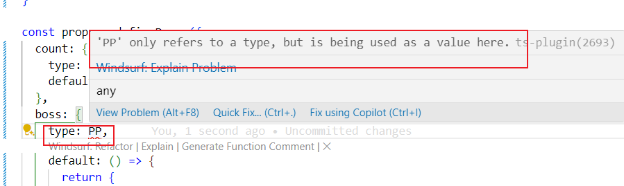

1.ts的优势和劣势

优势，用明确的类型定义，在开发时就帮助屏蔽了很多误用的错误，比如某个方法参数是字符串，结果实际数据传过来是数字。在js里这只有到了运行时才能发现，但ts可以在编写代码时就提前发现这种潜在问题

劣势，学习和使用的成本，乱用的成本

2.注意基础类型中 `string` 和 `String` 的区别

string 是ts里的一个类型限定符，最后的js中不存在。而 `String` 是js中的一个构造函数

```typescript
let name:string = 'hello' // 这就是ts里的定义
```

在 `vue3` 里定义 `props` 属性的类型时，用`name： { type: String }` , 这里用构造函数来判断是不是字符串类型。这里为什么是 `String`，而不是 `string`？因为 `string` 是 ts 中独有的一个“类型”，在最后的js环境里并不存在，而 vue 最后运行的是 js代码，在js里只能通过 `String` 来判断是不是字符串. 推广到其他类型，包括自己定义的 type 和 interface，都不可以直接用来定义 props 的属性，会报下面的错。



3.enum

创建常量用的，特别适合状态码，分类等场景。就是个key和value

可以用数字或者字符串。如果定义的是数字，可以通过前面的key得到后面的value，也可以通过后面的value得到前面的key，但字符串不行。

本质就是个立即执行函数，创建个对象而已。

有个特殊点：常量枚举，在枚举前面加个const，它跟普通枚举不同的是：普通枚举在编译后，使用他们的地方还是个[对象.key]的形式，但常量枚举编译后，就是用 value 替换了对应的key，项目里根本就没有枚举，或者说那个枚举对象的存在。

```typescript
const enum COLOR3 {
    RED = 1,
    GREEN = 2,
}

console.log(COLOR3.GREEN);
=================================>>>>>>>>>>>>>>>>>>>>>>
console.log(2 /* COLOR3.GREEN */); // 编译后
```

4.什么是 .d.ts 文件？干嘛用的？

如果一个项目完全是自己从头用ts写的，不涉及任何其他第三方库，那只要在ts里写好各种类型声明和定义就可以了，不会报错。但是通常这是不现实的，很多时候我们会遇到node环境或者browser环境，而关于他们的库，变量，方法，类，很多都是js写的。显然这些内容我们无法在他们的代码里添加ts声明，而恰恰为了在ts里使用这些js库和代码时也能有明确的类型检查，我们可以通过.d.ts 来定义类型，通过 lib方法引入

在项目根的`tsconfig.app.json`文件里，有这么一句：

```typescript
`"include": ["env.d.ts", "src/**/*", "src/**/*.vue", "src/**/*.tsx", "src/**/**/*.tsx"]`
```

这里面很重要一点：导入了`src`下的路径，这样自己单独创建的`src/types/obj.type.d.ts` 里写的类型声明就可以在 `App.vue` 里使用了,**关键是不用导入**

```typescript
const obj1 = ref<BigObj>({ name: 'obj1', size: 100 })
```

如果表示`tsconfig.app.json` 里配置了，那这里对 `BigObj` 的使用就会报错，因为找不到类型定义

> 对于一些不知道在哪里定义，或者不想在某个地方定义，然后到处去引用的类型，可以使用这种方法，定义个 `global.type.d.ts`.
> 定义时可以结合 namespace 方式，让这些类型分属不同的命名空间，防止命名冲突

```typescript
declare namespace API {
    function getListApi(): Array<string|number>
}
```

5.`dev` 只是监听文件变化后，重新编译 ts文件， `do` 使用`nodemon`监听文件变化后执行`exec`定义的命令，并且支持esm模块的 import 和 export
